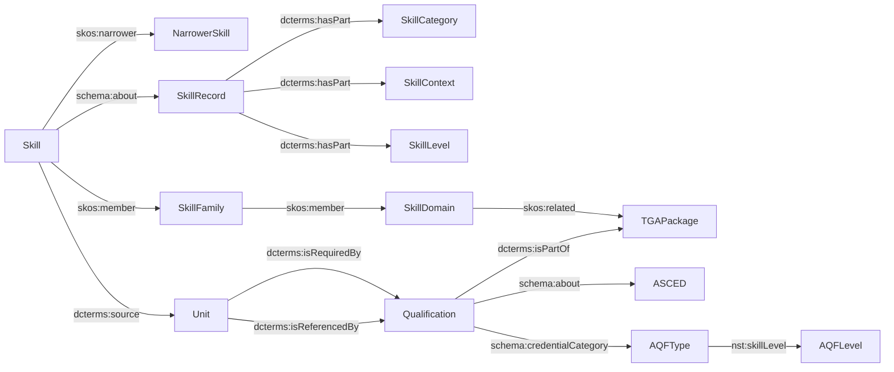

# skills-SPARQL
SPARQL code and resources to support skills vocabulary projects

Purpose (SPARQL for JSA skills + training)
How to run (YASGUI link + scripts/run.sh)
Notes (https schema.org, named graph IRIs)
Versioning convention for queries
Warning: don’t commit secrets / write endpoints

.editorconfig: enforce 2-space indent & LF newlines.
.gitattributes: *.rq linguist-language=SPARQL for GitHub highlighting.
GitHub Action later to syntax-check queries with Jena ARQ (only if you want CI).

skills-sparql/
├─ README.md
├─ queries/
│  ├─ ardc/
│  │  ├─ tgovau/
│  │  │  └─ ardc-tgovau-qual-unit-asced-anzsco-2025-08-11-v01.rq
│  │  └─ skills/
│  │     └─ seed-skill-to-quals-v01.rq
│  └─ local/
│     └─ diagnostics/
│        └─ list-graphs.rq
├─ snippets/
│  └─ prefixes.rq        # common PREFIX block
├─ scripts/
│  └─ run.sh             # curl helper to run queries
├─ results/               # optional saved CSVs
├─ .editorconfig
└─ .gitignore

Filename pattern:
<env>-<dataset>-<focus>-<extras>-<YYYY-MM-DD>-vNN.rq
e.g. ardc-tgovau-qual-unit-asced-anzsco-2025-08-11-v01.rq

Query header template (copy into top of each .rq)
/* -----------------------------------------------------------
Title: ARDC → TGA quals + units + ASCED + ANZSCO (seeded)
Endpoint: https://demo.vocabs.ardc.edu.au/repository/api/sparql/dewr_skills-knowledge-graph_11-august-2025
Graphs:
  - https://data.jobsandskills.gov.au/graph/Skills
  - https://data.jobsandskills.gov.au/graph/TrainingGovAu
  - https://data.jobsandskills.gov.au/graph/ASCED
  - https://data.jobsandskills.gov.au/graph/ANZSCO
Notes:
  - schema.org is HTTPS in this store
  - ANZSCO traversal bounded (no * range)
----------------------------------------------------------- */

