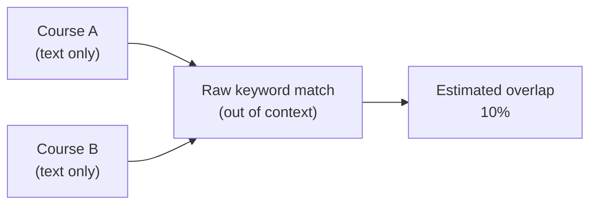
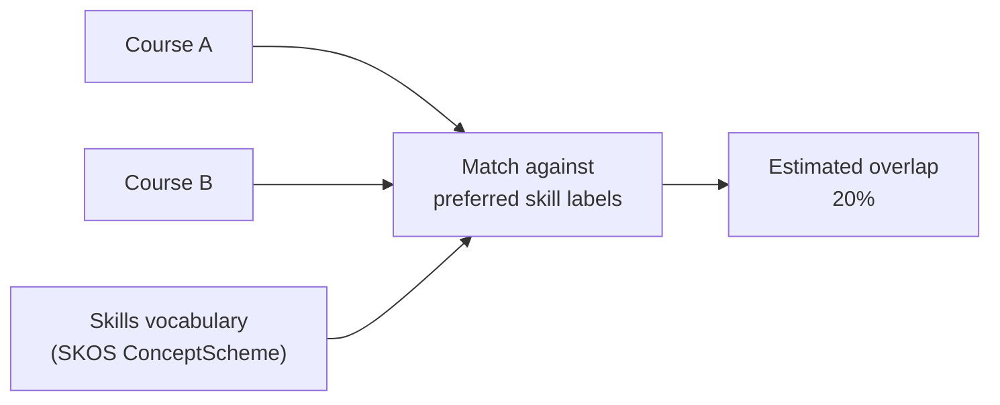
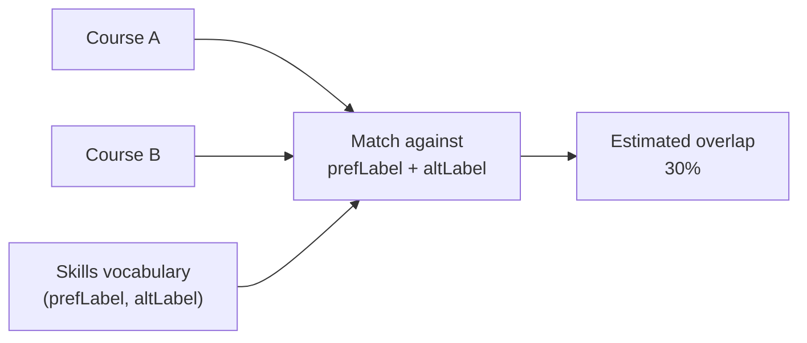
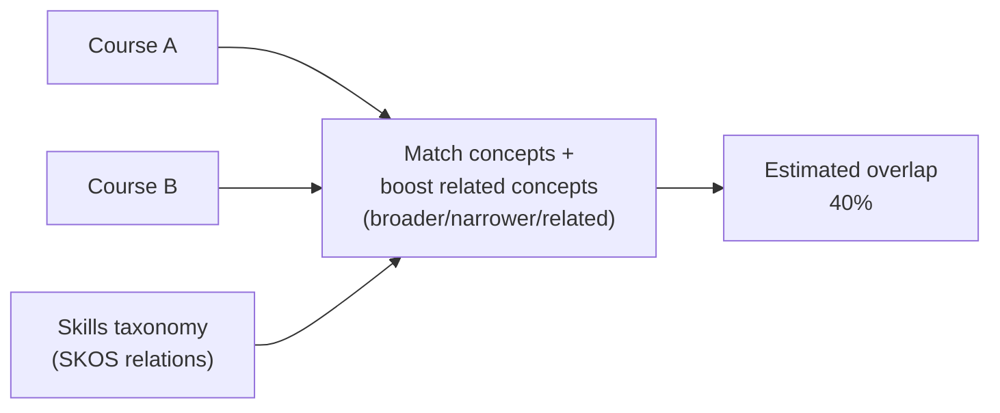
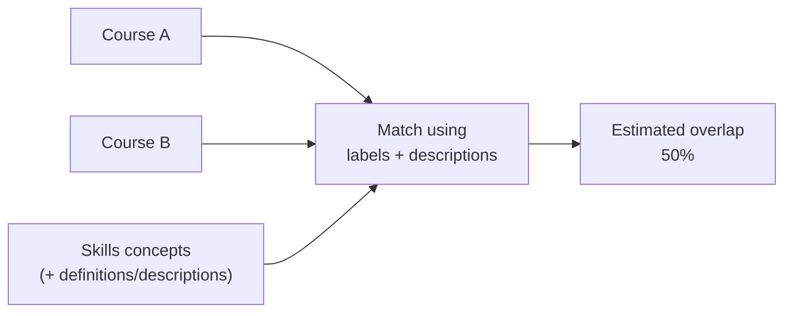
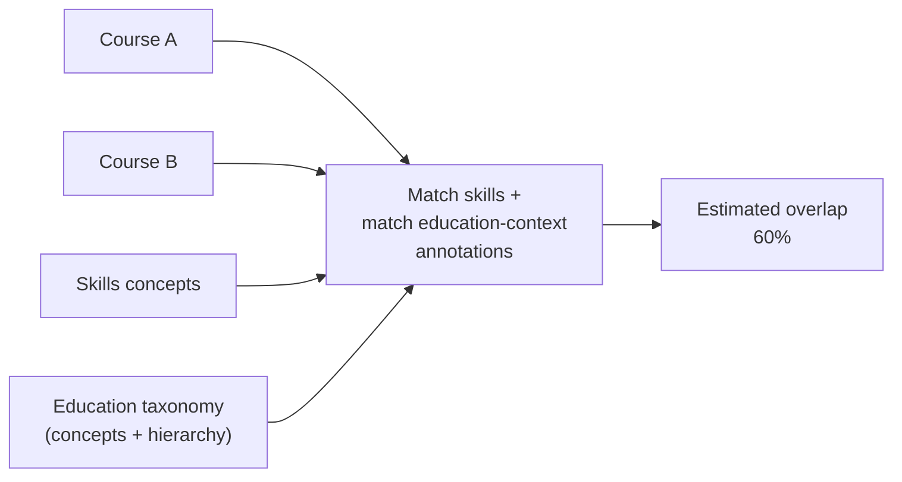
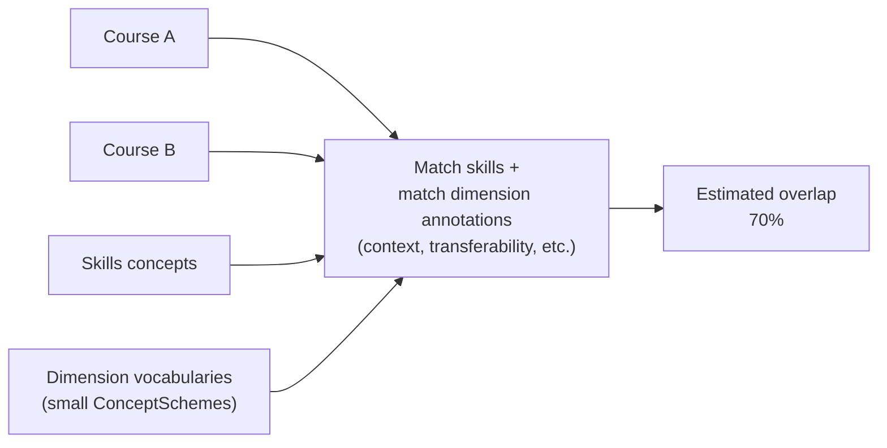
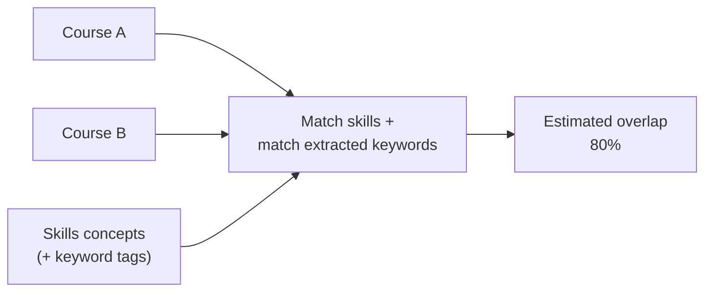
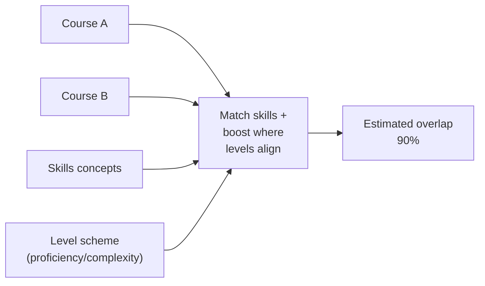

# Investigating credit transfer between Course A and Course B

A and B share some overlapping words and phrases, which allows a simple probabilistic estimate of similarity. Using a basic out-of-context keyword comparison, A and B show **10% overlap**.

**[Figure 1: A and B show 10% overlap from raw string matching]**

Next, we introduce a controlled vocabulary of skill concepts. Where terms in either record match a preferred skill label, they are given higher weight. This increases the estimated overlap to **20%**.

**[Figure 2: Preferred skill labels increase overlap to 20%]**

The vocabulary also includes alternative labels (synonyms). Matching against both preferred and alternative labels increases concept hits and raises the overlap to **30%**.

**[Figure 3: Preferred + alternative labels increase overlap to 30%]**

The skills vocabulary is organised as a taxonomy. Where skills referenced by A and B are related through broader/narrower and associative relations, that relatedness increases the weighting. The overlap rises to **40%**.

**[Figure 4: Skill hierarchy and relatedness increase overlap to 40%]**

Skill descriptions provide an additional text source for matching (beyond labels). Incorporating description text improves alignment and increases overlap to **50%**.

**[Figure 5: Skill descriptions increase overlap to 50%]**

Skills can also be annotated using an education taxonomy (e.g., education context). Matching those education concepts — including labels, alternative labels, and hierarchy inference — increases overlap to **60%**.

**[Figure 6: Education taxonomy annotations increase overlap to 60%]**

Additional small “dimension vocabularies” (learning context, transferability, theory–practice spectrum, etc.) enrich skill metadata. Matching on those dimensions lifts overlap to **70%**.

**[Figure 7: Skill dimension vocabularies increase overlap to 70%]**

Skills may be tagged with keywords extracted from authoritative sources. These keywords provide extra matching signals, raising overlap to **80%**.

**[Figure 8: Skill keyword enrichment increases overlap to 80%]**

Finally, applying weighting for proficiency/complexity levels (where available) further improves the estimate, resulting in **90% overlap**.

**[Figure 9: Level alignment increases overlap to 90%]**

# Figures

## Figure 1 — raw string match (10%)

## Figure 2 — preferred labels (20%)

## Figure 3 — preferred + alternative labels (30%)

## Figure 4 — hierarchy + relatedness (40%)

## Figure 5 — skill descriptions (50%)

## Figure 6 — education taxonomy annotations (60%)

## Figure 7 — dimension vocabularies (70%)

## Figure 8 — keyword enrichment (80%)

## Figure 9 — level alignment (90%)

