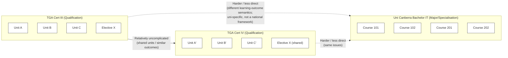
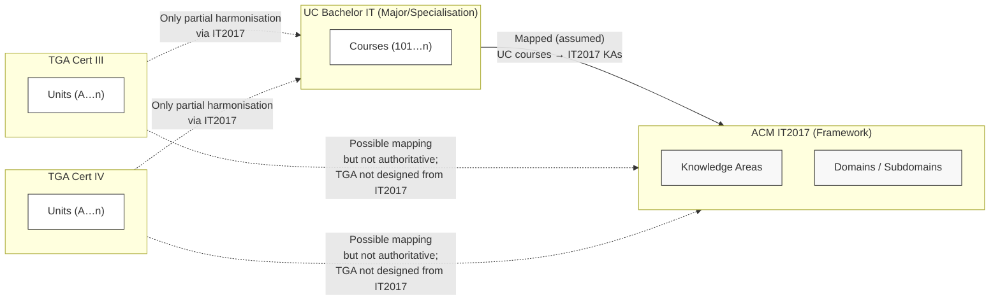
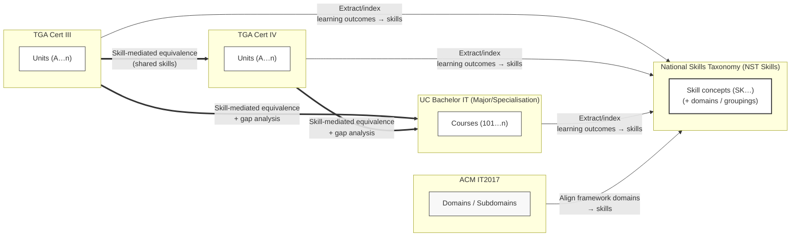

```mermaid
flowchart LR
  %% Diagram 1 — direct mappings (VET↔VET easier than VET↔HE)
  subgraph CertIII["TGA Cert III (Qualification)"]
    C3a["Unit A"]:::unit
    C3b["Unit B"]:::unit
    C3c["Unit C"]:::unit
    C3d["Elective X"]:::unit
  end

  subgraph CertIV["TGA Cert IV (Qualification)"]
    C4a["Unit A'"]:::unit
    C4b["Unit B'"]:::unit
    C4c["Unit C'"]:::unit
    C4x["Elective X (shared)"]:::unit
  end

  subgraph UCBIT["Uni Canberra Bachelor IT (Major/Specialisation)"]
    UC1["Course 101"]:::unit
    UC2["Course 102"]:::unit
    UC3["Course 201"]:::unit
    UC4["Course 202"]:::unit
  end

  CertIII -- "Relatively uncomplicated\n(shared units / similar outcomes)" --> CertIV
  CertIII -. "Harder / less direct\n(different learning-outcome semantics;\nuni-specific, not a national framework)" .-> UCBIT
  CertIV  -. "Harder / less direct\n(same issues)" .-> UCBIT

  classDef unit fill:#fff,stroke:#333,stroke-width:1px;
```

```mermaid
flowchart LR
  %% Diagram 2 — attempt harmonisation via IT2017 (helps HE more than VET)
  subgraph CertIII["TGA Cert III"]
    C3["Units (A…n)"]:::unit
  end

  subgraph CertIV["TGA Cert IV"]
    C4["Units (A…n)"]:::unit
  end

  subgraph UCBIT["UC Bachelor IT (Major/Specialisation)"]
    UC["Courses (101…n)"]:::unit
  end

  subgraph IT2017["ACM IT2017 (Framework)"]
    KA["Knowledge Areas"]:::scheme
    KAsub["Domains / Subdomains"]:::scheme
  end

  %% HE aligns more naturally (assumed mapping)
  UCBIT -- "Mapped (assumed)\nUC courses → IT2017 KAs" --> IT2017

  %% VET: possible mapping, but not designed with IT2017 in mind
  CertIII -. "Possible mapping\nbut not authoritative;\nTGA not designed from IT2017" .-> IT2017
  CertIV  -. "Possible mapping\nbut not authoritative;\nTGA not designed from IT2017" .-> IT2017

  %% therefore the crosswalk is still partial/uneven
  CertIII -. "Only partial harmonisation\nvia IT2017" .-> UCBIT
  CertIV  -. "Only partial harmonisation\nvia IT2017" .-> UCBIT

  classDef unit fill:#fff,stroke:#333,stroke-width:1px;
  classDef scheme fill:#f8f8f8,stroke:#333,stroke-width:1px;
```

```mermaid
flowchart LR
  %% Diagram 3 — NST Skills as the bridge (indexes VET + HE + IT2017)
  subgraph CertIII["TGA Cert III"]
    C3["Units (A…n)"]:::unit
  end

  subgraph CertIV["TGA Cert IV"]
    C4["Units (A…n)"]:::unit
  end

  subgraph UCBIT["UC Bachelor IT (Major/Specialisation)"]
    UC["Courses (101…n)"]:::unit
  end

  subgraph IT2017["ACM IT2017"]
    KA["Domains / Subdomains"]:::scheme
  end

  subgraph NST["National Skills Taxonomy (NST Skills)"]
    Skills["Skill concepts (SK…)\n(+ domains / groupings)"]:::hero
  end

  %% NST indexes everything
  CertIII -->|"Extract/index\nlearning outcomes → skills"| NST
  CertIV  -->|"Extract/index\nlearning outcomes → skills"| NST
  UCBIT  -->|"Extract/index\nlearning outcomes → skills"| NST
  IT2017 -->|"Align framework domains\n→ skills"| NST

  %% Then credit transfer becomes skill-mediated
  CertIII == "Skill-mediated equivalence\n+ gap analysis" ==> UCBIT
  CertIV  == "Skill-mediated equivalence\n+ gap analysis" ==> UCBIT
  CertIII == "Skill-mediated equivalence\n(shared skills)" ==> CertIV

  classDef unit fill:#fff,stroke:#333,stroke-width:1px;
  classDef scheme fill:#f8f8f8,stroke:#333,stroke-width:1px;
  classDef hero fill:#fff,stroke:#333,stroke-width:2px;
```
