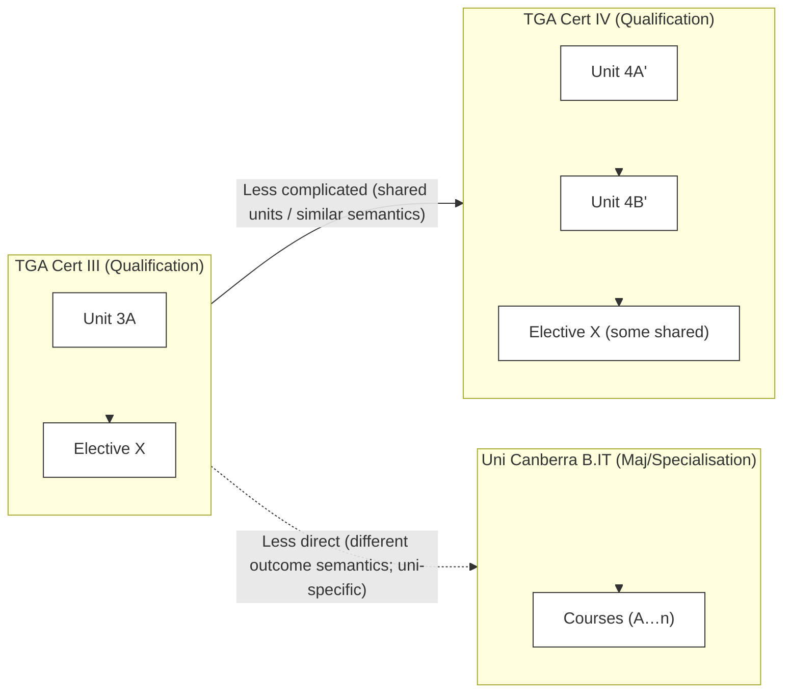
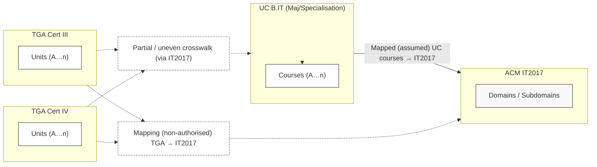
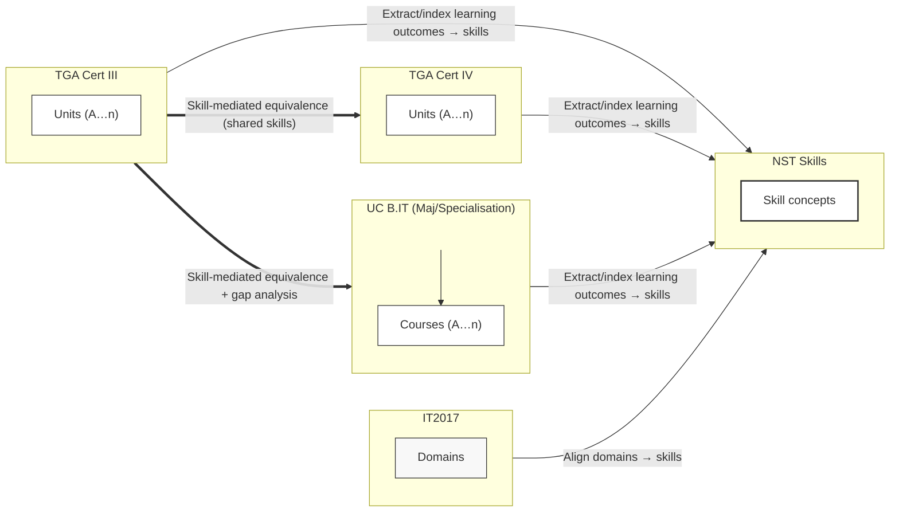

```mermaid
flowchart LR
  %% Diagram 1 — direct mappings (VET↔VET easier than VET↔HE)

  subgraph CertIII["TGA Cert III (Qualification)"]
    C3a["Unit 3A"]:::unit
    C3d["Elective X"]:::unit
    C3a --> C3d
  end

  subgraph CertIV["TGA Cert IV (Qualification)"]
    C4a["Unit 4A'"]:::unit
    C4b["Unit 4B'"]:::unit
    C4x["Elective X (some shared)"]:::unit
    C4a --> C4b
    C4b --> C4x
  end

  subgraph UCBIT["Uni Canberra B.IT (Maj/Specialisation)"]
    spacer[" "]:::spacer
    UC["Courses (A…n)"]:::unit
    spacer --> UC
  end

  %% Semantic arrows (the ones you care about)
  CertIII -- "Less complicated (shared units / similar semantics)" --> CertIV
  CertIII -. "Less direct (different outcome semantics; uni-specific)" .-> UCBIT

  classDef unit fill:#fff,stroke:#333,stroke-width:1px;
  classDef spacer fill:none,stroke:none;

  %% Hide ONLY the internal stacking links:
  %% 0: C3a-->C3d
  %% 1: C4a-->C4b
  %% 2: C4b-->C4x
  %% 3: spacer-->UC
  linkStyle 0,1,2,3 stroke-width:0px;
```

```mermaid
flowchart LR
  %% Diagram 2 — attempt mapping via IT2017 (helps HE more than VET)

  subgraph CertIII["TGA Cert III"]
    C3["Units (A…n)"]:::unit
  end

  subgraph CertIV["TGA Cert IV"]
    C4["Units (A…n)"]:::unit
  end

  subgraph UCBIT["UC B.IT (Maj/Specialisation)"]
    spacer[" "]:::spacer
    UC["Courses (A…n)"]:::unit
    spacer --> UC
  end

  subgraph IT2017["ACM IT2017"]
    KA["Domains / Subdomains"]:::scheme
  end

  %% HE aligns (assumed mapping)
  UCBIT -- "Mapped (assumed) UC courses → IT2017" --> IT2017

  %% VET: possible mapping, with no explicit IT2017 mapping
  VetITMap["Mapping (non-authorised) TGA → IT2017"]:::mapping
  CertIII -.-> VetITMap
  CertIV  -.-> VetITMap
  VetITMap -.-> IT2017

 %% therefore crosswalk is still partial/uneven
PartialXwalk["Partial / uneven crosswalk (via IT2017)"]:::mapping

CertIII -.-> PartialXwalk
CertIV  -.-> PartialXwalk
PartialXwalk -.-> UCBIT

  classDef unit fill:#fff,stroke:#333,stroke-width:1px;
  classDef scheme fill:#f8f8f8,stroke:#333,stroke-width:1px;
  classDef spacer fill:none,stroke:none;
  classDef mapping fill:#fff,stroke:#666,stroke-dasharray: 4 2;

  %% Hide ONLY the spacer link (the first link defined in this diagram)
  linkStyle 0 stroke-width:0px;
```

```mermaid
flowchart LR
  %% Diagram 3 — NST Skills as bridge (indexes VET + HE + IT2017)
  subgraph CertIII["TGA Cert III"]
    C3["Units (A…n)"]:::unit
  end

  subgraph CertIV["TGA Cert IV"]
    C4["Units (A…n)"]:::unit
  end

 subgraph UCBIT["UC B.IT (Maj/Specialisation)"]
    spacer[" "]:::spacer
    UC["Courses (A…n)"]:::unit
    spacer --> UC
  end

  subgraph IT2017["IT2017"]
    KA["Domains"]:::scheme
  end

  subgraph NST["NST Skills"]
    Skills["Skill concepts"]:::hero
  end

  %% NST indexes everything
  CertIII -->|"Extract/index learning outcomes → skills"| NST
  CertIV  -->|"Extract/index learning outcomes → skills"| NST
  UCBIT  -->|"Extract/index learning outcomes → skills"| NST
  IT2017 -->|"Align domains → skills"| NST

  %% Credit transfer becomes skill-mediated
  CertIII == "Skill-mediated equivalence + gap analysis" ==> UCBIT
  CertIII == "Skill-mediated equivalence (shared skills)" ==> CertIV

  classDef unit fill:#fff,stroke:#333,stroke-width:1px;
  classDef scheme fill:#f8f8f8,stroke:#333,stroke-width:1px;
  classDef spacer fill:none,stroke:none;
  classDef hero fill:#fff,stroke:#333,stroke-width:2px;
```
