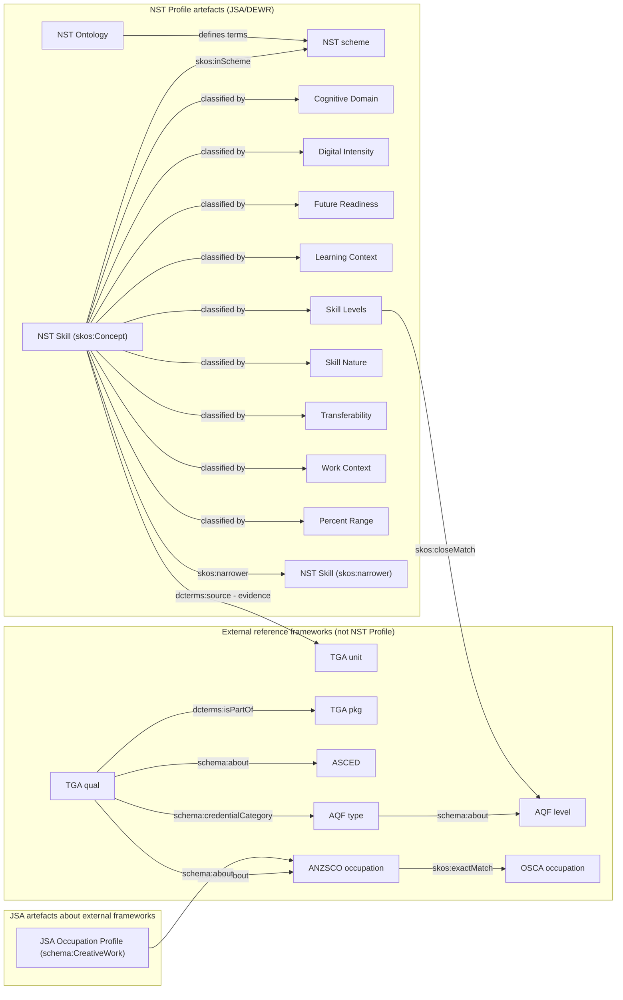

```mermaid
flowchart LR

  %% =========================
  %% NST PROFILE ARTEFACTS (published by JSA/DEWR)
  %% =========================
  subgraph NST["NST Profile artefacts (JSA/DEWR)"]
    direction LR

    Ont["NST Ontology <https://test.linked.data.gov.au/def/nst/ontology>"]

    NSTScheme["NST scheme <https://test.linked.data.gov.au/def/nst>"]
    Cog["Cognitive Domain <https://test.linked.data.gov.au/def/nst-cognitive-domain>"]
    Dig["Digital Intensity <ttps://test.linked.data.gov.au/def/nst-digital-intensity>"]
    Fut["Future Readiness <https://test.linked.data.gov.au/def/nst-futureready>"]
    Learn["Learning Context <https://test.linked.data.gov.au/def/nst-learning-context>"]
    Level["Skill Levels <https://test.linked.data.gov.au/def/nst-level>"]
    Nature["Skill Nature <https://test.linked.data.gov.au/def/nst-nature>"]
    Trans["Transferability <https://test.linked.data.gov.au/def/nst-transferability>"]
    Work["Work Context <https://test.linked.data.gov.au/def/nst-work-context>"]
    Percent["Percent Range <https://test.linked.data.gov.au/def/nst-percent-range>"]

    Skill["NST Skill (skos:Concept)"]
    Narrower["NST Skill (skos:narrower)"]

    Skill -->|skos:narrower| Narrower
    Skill -->|skos:inScheme| NSTScheme

    %% Facet links (predicate labels illustrative)
    Skill -->|classified by | Level
    Skill -->|classified by| Dig
    Skill -->|classified by| Fut
    Skill -->|classified by| Learn
    Skill -->|classified by| Cog
    Skill -->|classified by| Nature
    Skill -->|classified by| Trans
    Skill -->|classified by| Work
    Skill -->|classified by| Percent

    Ont -->|defines terms| NSTScheme
  end

  %% =========================
  %% EXTERNAL REFERENCE FRAMEWORKS (not published by NST Profile)
  %% =========================
  subgraph EXT["External reference frameworks (not NST Profile)"]
    direction LR

    Unit["TGA unit"]
    Qual["TGA qual"]
    Pack["TGA pkg"]

    ASCED["ASCED"]
    AQFType["AQF type"]
    AQFLevel["AQF level"]

    ANZSCO["ANZSCO occupation"]
    OSCA["OSCA occupation"]
  end

  %% =========================
  %% JSA ARTEFACTS ABOUT EXTERNALS
  %% =========================
  subgraph JSAEXT["JSA artefacts about external frameworks"]
    direction LR
    OccProfile["JSA Occupation Profile (schema:CreativeWork)"]
  end

  %% =========================
  %% CROSS-BOUNDARY LINKS
  %% =========================

  Skill -->|dcterms:source - evidence| Unit

  Qual -->|dcterms:isPartOf| Pack
  Qual -->|schema:about| ASCED
  Qual -->|schema:credentialCategory| AQFType
  AQFType -->|schema:about| AQFLevel
  Level -->|skos:closeMatch| AQFLevel

  %% Corrected canonical direction:
  Qual -->|schema:about| ANZSCO

  OccProfile -->|schema:about| ANZSCO

  ANZSCO -->|skos:exactMatch| OSCA
```
