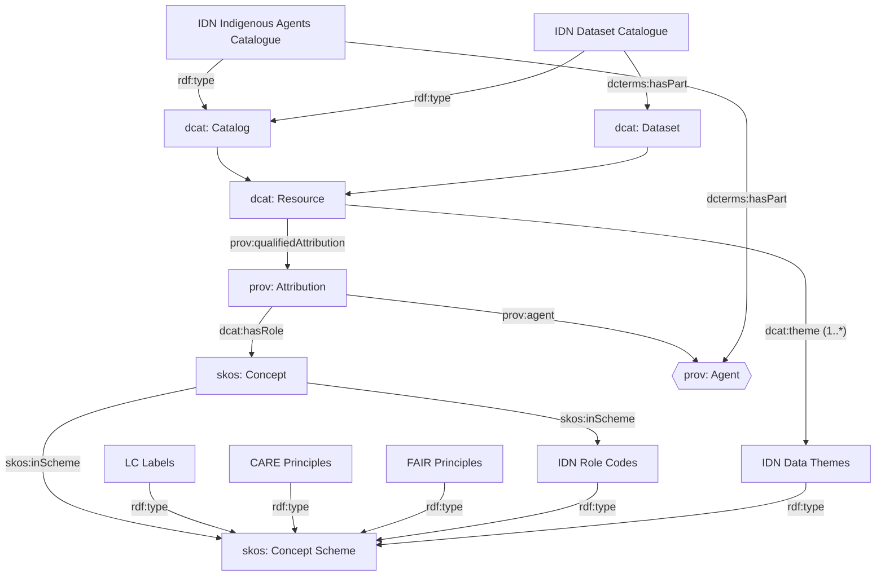

```mermaid
flowchart TB
  %% Core SKOS
  CS["skos: Concept Scheme"]
  C["skos: Concept"]

  C -->|skos:inScheme| CS

  %% PROV attribution pattern
  AG{{"prov: Agent"}}
  ATT["prov: Attribution"]

  ATT -->|prov:agent| AG
  ATT -->|dcat:hasRole| C

  %% DCAT resource pattern
  R["dcat: Resource"]
  CAT["dcat: Catalog"]
  DS["dcat: Dataset"]

  R -->|prov:qualifiedAttribution| ATT
  CAT --> R
  DS --> R

  %% Catalog instances
  IAC["IDN Indigenous Agents Catalogue"]
  IDC["IDN Dataset Catalogue"]

  IAC -->|rdf:type| CAT
  IDC -->|rdf:type| CAT

  IAC -->|dcterms:hasPart| AG
  IDC -->|dcterms:hasPart| DS

  %% External concept schemes / vocabularies
  LCL["LC Labels"]
  CARE["CARE Principles"]
  FAIR["FAIR Principles"]
  ROLE["IDN Role Codes"]
  THEME["IDN Data Themes"]

  LCL -->|rdf:type| CS
  CARE -->|rdf:type| CS
  FAIR -->|rdf:type| CS
  ROLE -->|rdf:type| CS
  THEME -->|rdf:type| CS

  C -->|skos:inScheme| ROLE
  R -->|"dcat:theme (1..*)"| THEME
```
